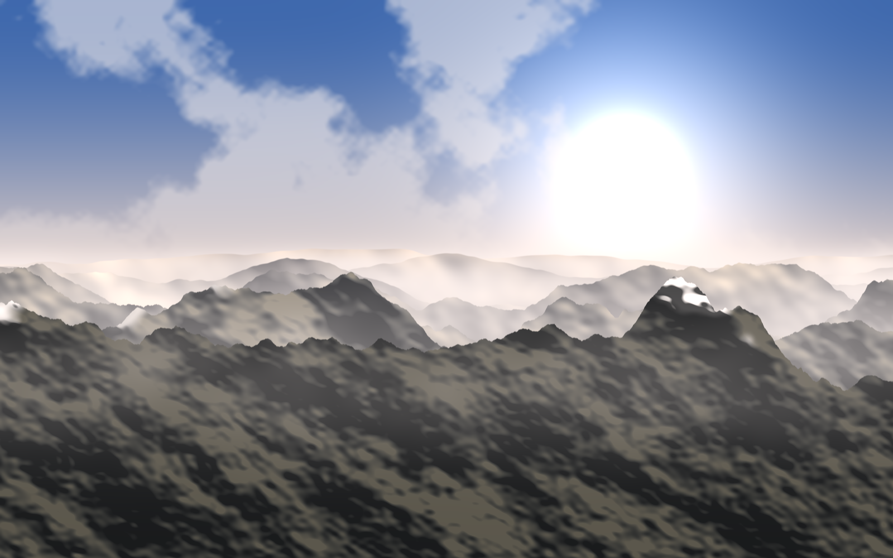

# math-art

A nature landscape that is not a photograph and not a painting — every pixel is a mathematical function of its position.

## `landscape.py`



An ultra-real dawn mountainscape generated entirely from fractal noise and gradients:

- **Ridgelines** — seven mountain ranges, each a 1‑D fractal-noise silhouette, composited far to near.
- **Atmospheric perspective** — distant ranges wash toward the haze color; fog pools between them. This depth cue is what sells the realism.
- **Lighting** — each range carries a 2‑D fractal height field; its (smoothed) gradient is dotted with the sun direction, so slopes facing the sun catch light and the rest fall into shadow.
- **Golden hour** — lit faces are warmed, shadows cooled — the single strongest photorealism cue.
- **Snow & sky** — snow on the highest near peaks; a graded dawn sky with sun glow and fractal clouds.

```bash
python3 landscape.py      # writes landscape.png
```

Requires `numpy`, `scipy`, and `Pillow`.

## `plasma.py`

A morphing truecolor plasma field for the terminal, built from layered sine waves. `python3 plasma.py` (Ctrl-C to quit).

## License

MIT
